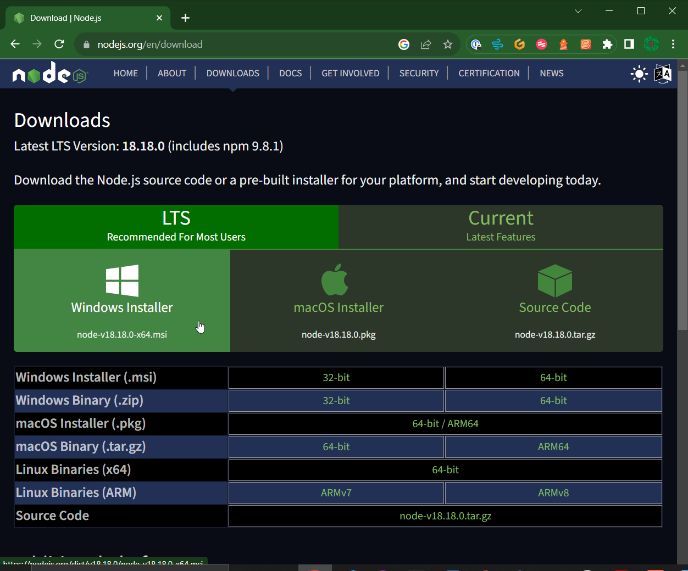
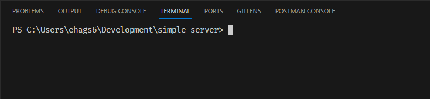
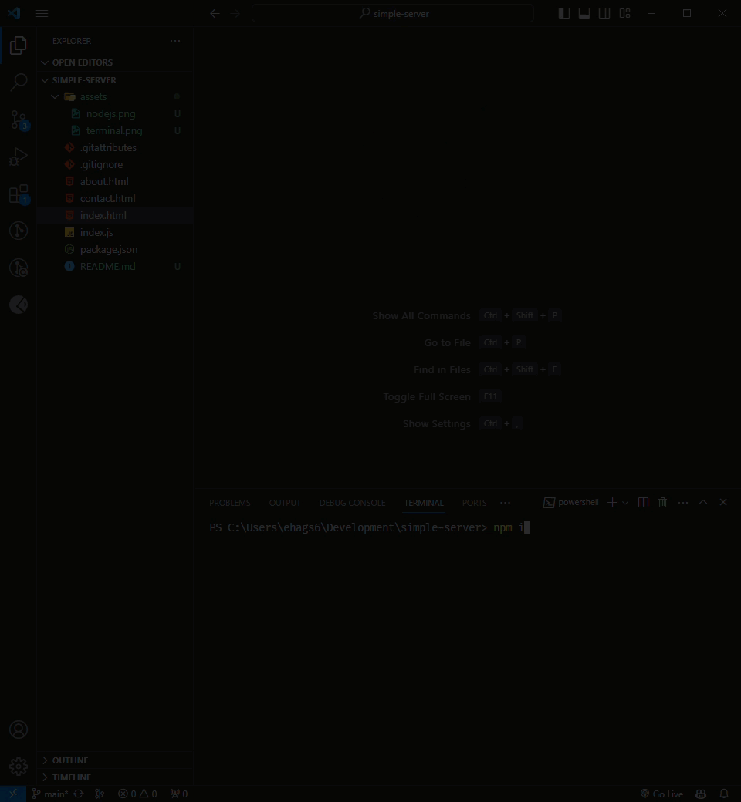
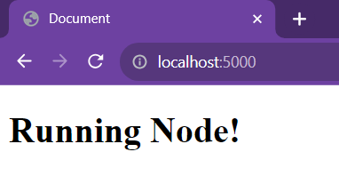

# Simple Node Express Server

## Purpose

This project is designed to provide a simple example of how server software responds to network requests.

## Project setup

### 1. NodeJS installation

If you haven't already got NodeJS on your machine, download and install the latest LTS version from the [NodeJS download page](https://nodejs.org/en/download):



### 2. Copy the zip file from OneNote

Head over to OneNote and download the zip file from today's lesson. This can be found at:

> **OneNote > U13 - Web Design and Development > Assignment 1 > 03 Web Hardware and Software**

Open the zip file, and copy the folder inside to a space on your computer that is outside of your Documents folder, or anywhere else that will sync to OneDrive.

> ### Why save our project folder outside of OneDrive?
>
> We will shortly be installing the [dependencies](https://www.perplexity.ai/search/What-are-dependencies-crov0b75RnOYIwKYEH2zrg?s=c) required for the Node Express server to work.
>
> These are hundreds, sometimes thousands of files in size! We don't want OneDrive to try and sync these files, so we need to keep our Node projects separate from our other work.

### 3. Open the project in VS Code

Open VS Code on your machine, and from the menu at the top of the screen, click _File > Open Folder..._. Find the project folder you copied across in the last step and open it.

### 4. Install dependencies

With your project folder open in VS Code, click _Terminal > New Terminal_ from your top menu. You will see a new terminal window open at the bottom of your screen:



Type the following command into your terminal window, and hit Return:

```bash
npm i
```

Watch carefully and see the dependencies being installed into your project.



Can you see a new `node_modules` folder has appeared in your side panel? This is where the dependencies are stored for your project.

Feel free to take a look inside here, but don't change anything or your application will break!

## Starting the server

With your dependencies installed, type the command below into your VS Code terminal window and hit Return:

```bash
node index.js
```

After you see a message saying `Now listening on port 5000`, open your Chrome web browser. Type in the following to the URL bar:

```
http://localhost:5000
```

You should see the message below appear in your browser window:



### Congratulations! You have a Node server working on your machine!
